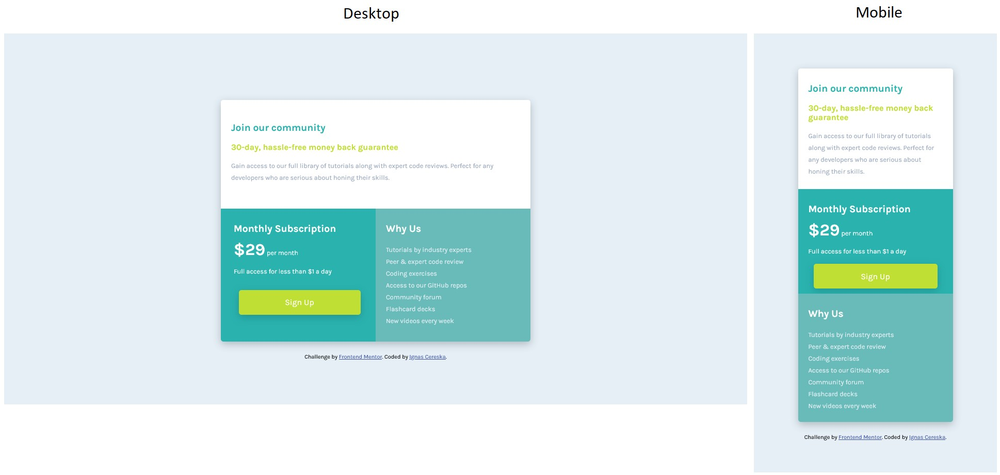

# Frontend Mentor - Single price grid component solution

This is a solution to the [Single price grid component challenge on Frontend Mentor](https://www.frontendmentor.io/challenges/single-price-grid-component-5ce41129d0ff452fec5abbbc). Frontend Mentor challenges help you improve your coding skills by building realistic projects. 

## Table of contents

- [Overview](#overview)
  - [The challenge](#the-challenge)
  - [Screenshot](#screenshot)
- [My process](#my-process)
  - [Built with](#built-with)
  - [What I learned](#what-i-learned)
  - [Continued development](#continued-development)
  - [Useful resources](#useful-resources)
- [Author](#author)

## Overview

### The challenge

Users should be able to:

- View the optimal layout depending on their device's screen size
- See hover states for interactive elements (if there are any)

### Screenshot

## My process

### Built with

- HTML5 and CSS
- Visual Studio Code software

### What I learned

Got some practice applying grid areas and assigning them to certain webpage elements to create the right arrangment.

Found out that firefox dev window is very helpfull to troubleshoot when a property is not being applies or to check accesibility.

Flex box is a great way to center the whole page vertically and horizontally by applying it to box element and wrapping everything inside the box element into a div element. Is it a good practice? I do not know yet.

### Continued development

First attempt to apply a grid layout, instead of a flex box, although flexbox is used to center the whole page vertically on desktop version. Need to work more on creating the right sizes, margins, paddings within the grid.

I am checking the font contrast more often now, although on this page it is still comming up as an issue after increasing text brightness so it stands out more. Tried to keep a balance between styling guide and accesibility reading. This is the first time I decided to break the styling rules to push closer to meeting accesibility requirements of the website for text readability.

### Useful resources

- (https://www.w3schools.com) - My main goto when I need to remember certain things in html and css.

## Author

- Frontend Mentor - [@ignasc](https://www.frontendmentor.io/profile/ignasc)
- Github - [@ignasc](https://github.com/ignasc)
- Twitter - [@Ignasc](https://twitter.com/Ignasc)
- Instagram - [@ignas.c](https://www.instagram.com/ignas.c/)
